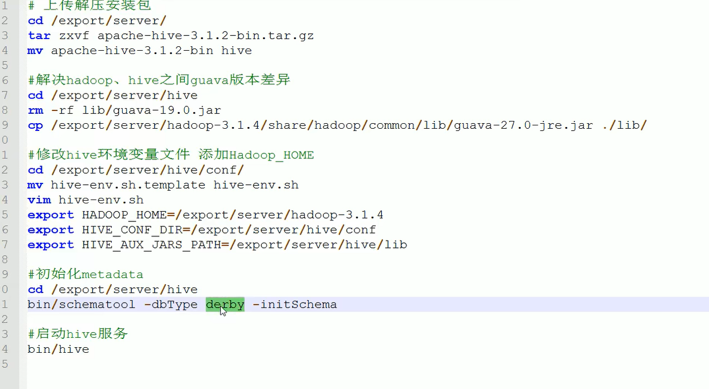
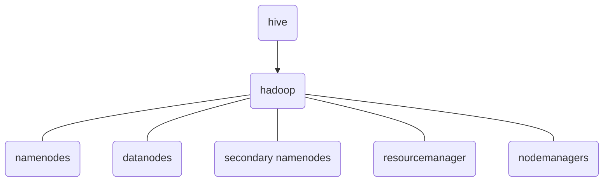

### 案例

```sql
CREATE DATABASE janus;
create table animal (name varchar(8), age int);
insert into animal(name, age) values('cat',10);
```

### 启动

```bash
hive --service metastore &
hive --service hiveserver2 &
# 初始化
 bin/schematool -dbType mysql -initSchema
hiveserver2
beeline -u "jdbc:hive2://localhost:10000" -n janus

SET hive.execution.engine=tez;
```



### 架构



|                     |                                                              |
| ------------------- | ------------------------------------------------------------ |
| namenodes           | HDFS的一部分，负责管理文件系统的命名空间和控制客户端对文件的访问 |
| datanodes           | HDFS的一个组成部分，它负责存储实际的数据块                   |
| secondaty namenodes | 帮助namenode合并编辑日志和fsimage，减少namenode启动时间      |
| resourcemanager     | YARN的一部分，负责整个集群的资源管理和分配                   |
| nodemanagers        | 属于YARN体系，负责单个节点上的资源管理和使用情况汇报         |

|      |                                 |
| ---- | ------------------------------- |
| HDFS | Hadoop Distributed File System  |
| YARN | Yet Another Resource Negotiator |
|      |                                 |

### 命令

|             |                                                      |
| ----------- | ---------------------------------------------------- |
| `hadoop fs` | 用于与 Hadoop 分布式文件系统（HDFS）交互的命令行工具 |
|             |                                                      |
|             |                                                      |

### 安装

#### hadoop

1. 修改配置文件，`$HADOOP_HOME/etc/hadoop/core-site.xml`

   ```xml
   <configuration>
       <!--hdfs服务端口-->
       <property>
           <name>fs.defaultFS</name>
           <value>hdfs://localhost:9000</value>
       </property>
       <!--hdfs的宿主机目录-->
       <property>
           <name>hadoop.tmp.dir</name>
           <value>/opt/hadoop-2.10.2/tmp</value>
       </property>
       <!--允许连接用户所在组-->
       <property>
           <name>hadoop.proxyuser.users.groups</name>
           <value>*</value>
       </property>
       <!--允许连接Host-->
       <property>
           <name>hadoop.proxyuser.janus.hosts</name>
           <value>*</value>
       </property>
   </configuration>
   ```

2. 配置`JAVA_HOME`，`HADOOP_HOME/etc/hadoop/hadoop-env.sh`

   ```bash
   export JAVA_HOME=$JAVA_HOME
   ```

3. 解决ssh连接本机

    ```bash
    ssh-keygen -t rsa -P '' -f ~/.ssh/id_rsa
    cat ~/.ssh/id_rsa.pub >> ~/.ssh/authorized_keys
    ```

4. 启动

   ```bash
   # 初始化 hdfs
   hdfs namenode -format
   sbin/start-all.sh
   ```

#### hive

1. 创建配置文件，`HIVE_HOME/conf/core-site.xml`

   ```xml
   <configuration>
       <property>
           <name>javax.jdo.option.ConnectionURL</name>
           <value>jdbc:mysql://localhost:3306/hive?createDatabaseIfNotExist=true&amp;useSSL=false</value>
       </property>
       <property>
           <name>javax.jdo.option.ConnectionDriverName</name>
           <value>com.mysql.jdbc.Driver</value>
       </property>
       <property>
           <name>javax.jdo.option.ConnectionUserName</name>
           <value>janus</value>
       </property>
       <property>
           <name>javax.jdo.option.ConnectionPassword</name>
           <value>janus</value> 
       </property>
       <property>
           <name>hive.server2.thrift.bind.host</name>
           <value>localhost</value>
       </property>
   
       <property>
           <name>hive.metastore.event.db.notification.api.auth</name>
           <value>false</value>
       </property>
   
       <property>
           <name>hive.metastore.schema.verification</name>
           <value>false</value>
       </property>
   </configuration>
   
   ```

   

   ```xml
   <configuration>
       <property>
           <name>javax.jdo.option.ConnectionURL</name>
           <value>jdbc:mysql://localhost:3306/hive?createDatabaseIfNotExist=true&amp;useSSL=false</value>
       </property>
       <property>
           <name>javax.jdo.option.ConnectionDriverName</name>
           <value>com.mysql.jdbc.Driver</value>
       </property>
       <property>
           <name>javax.jdo.option.ConnectionUserName</name>
           <value>janus</value>
       </property>
       <property>
           <name>javax.jdo.option.ConnectionPassword</name>
           <value>janus</value> 
       </property>
       <property>
           <name>hive.server2.thrift.bind.host</name>
           <value>localhost</value>
       </property>
   
       <property>
           <name>hive.metastore.event.db.notification.api.auth</name>
           <value>false</value>
       </property>
   
       <property>
           <name>hive.metastore.schema.verification</name>
           <value>false</value>
       </property>
       <property>
           <name>hive.server2.authentication</name>
           <value>SIMPLE</value>
           <!-- 可选值包括 NONE, LDAP, KERBEROS, CUSTOM, PAM, NOSASL -->
       </property>
       <property>
           <name>hive.server2.enable.doAs</name>
           <value>false</value>
       </property>
   </configuration>
   ```

2. 配置jar包

   ```bash
   sudo cp /home/janus/.m2/repository/mysql/mysql-connector-java/5.1.47/mysql-connector-java-5.1.47.jar 、
   /opt/hive-2.1.0/lib
   
   
   # hive-env.sh
   HADOOP_HOME=/usr/local/hadoop
   HIVE_CONF_DIR=/usr/local/hadoop/conf
   HIVE_AUX_JARS_PATH=/usr/local/hadoop/lib
   ```

3. 初始化

   ```bash
   schematool -dbType mysql -initSchema
   schematool -dbType derby -initSchema
   ```

4. 启动

   ```bash
   hive --service metastore 
   hive --service hiveserver2 
   ```

   

#### 安装hive, hadoop

```bash
sudo tar -xvf apache-hive-4.0.1-bin.tar.gz  -C /usr/local/ && sudo  mv /usr/local/apache-hive-4.0.1-bin /usr/local/hive
sudo tar -xvf hadoop-3.4.1.tar.gz  -C /usr/local/ &&  sudo mv /usr/local/hadoop-3.4.1 /usr/local/hadoop

# 添加下面内容到~/.bashrc，方便命令行启动
export HIVE_HOME=/usr/local/hive
export PATH=$PATH:$HIVE_HOME/bin

export HADOOP_HOME=/usr/local/hadoop
export PATH=$PATH:$HADOOP_HOME/bin
```

​	

#### 启动

```bash
sudo chown -R janus:janus hadoop/ hive/
# 初始化
hdfs namenode -format
schematool -dbType mysql -initSchema
```

```bash
# hive启动前操作
hive --service metastore 
hive --service hiveserver2 
```


### hadoop启动

1. 修改配置文件

   ```xml
   <--!文件路径：$HADOOP_HOME/etc/hadoop/core-site.xml-->
   <configuration>
       <!--hdfs服务端口-->
       <property>
           <name>fs.defaultFS</name>
           <value>hdfs://localhost:9000</value>
       </property>
       <!--hdfs的宿主机目录-->
       <property>
           <name>hadoop.tmp.dir</name>
           <value>/opt/hadoop-2.10.2/tmp</value>
       </property>
       <!--允许连接用户所在组-->
       <property>
           <name>hadoop.proxyuser.users.groups</name>
           <value>*</value>
       </property>
       <!--允许连接Host-->
       <property>
           <name>hadoop.proxyuser.janus.hosts</name>
           <value>*</value>
       </property>
   </configuration>
   ```

   ```bash
   # path：$HADOOP_HOME/etc/hadoop/hadoop-env.sh
   # 环境变量切换成实际路径，hadoop启动识别不了系统环境变量
   export JAVA_HOME=$JAVA_HOME
   ```

2. 初始化hdfs

   ```bash
   hdfs namenode -format
   ```

3. 启动

   ```bash
   $HADOOP_HOME/sbin/start-all.sh
   # 启动成功会运行5个jar包: DataNode, NodeManager, SecondaryNameNode, ResourceManager, NameNode
   
   # 若提示ssh无法连接，做如下配置，默认ssh是无法localhost连接localhost的
   ssh-keygen -t rsa -P '' -f ~/.ssh/id_rsa
   cat ~/.ssh/id_rsa.pub >> ~/.ssh/authorized_keys
   ```

   

### hive内置的Derby启动

​	**确保所有相关目录、文件当前用户有读写权限，特别是dpfs的。**
​	下述所有的shell环境变量，需要自行切换成实际目录。

1. 修改hive配置文件

   ```xml
   <--!文件路径：$HIVE_HOME/conf/hive-site.xml，需要自己创建-->
   <configuration>
     <property>
       <name>javax.jdo.option.ConnectionURL</name>
       <value>jdbc:derby:;databaseName=metastore_db;create=true</value>
       <description>JDBC connect string for a JDBC metastore</description>
     </property>
     <property>
       <name>javax.jdo.option.ConnectionDriverName</name>
       <value>org.apache.derby.jdbc.EmbeddedDriver</value>
       <description>Driver class name for a JDBC metastore</description>
     </property>
     <property>
       <name>javax.jdo.option.ConnectionUserName</name>
       <value>janus</value>
       <description>Username to use against metastore database</description>
     </property>
     <property>
       <name>javax.jdo.option.ConnectionPassword</name>
       <value>janus</value>
       <description>Password to use against metastore database</description>
     </property>
     <property>
       <name>datanucleus.autoCreateSchema</name>
       <value>true</value>
     </property>
     <property>
       <name>datanucleus.fixedDatastore</name>
       <value>false</value>
     </property>
   </configuration>
   ```

   ```bash
   # cp $HIVE_HOME/conf/hive-env.sh.template $HIVE_HOME/conf/hive-env.sh
   # 使用上述命令创建文件后，修改下面的内容
   HADOOP_HOME=$HADOOP_HOME
   # Hive Configuration Directory can be controlled by:
   export HIVE_CONF_DIR=$HADOOP_HOME/conf
   # Folder containing extra libraries required for hive compilation/execution can be controlled by:
   export HIVE_AUX_JARS_PATH=$HADOOP_HOME/bin
   ```

2. 初始化

   ```bash
   # 元数据会保存在当前目录metastore_db，切记hive在当前目录启动
   schematool -dbType derby -initSchema
   ```

3. 启动使用

   ```bash
   # linux启动的默认日志地址/tmp/username/hive.log
   hiveserver2
   # -n <username>，hive-site.xml配置的username，本地连接不需要密码
   beeline -u "jdbc:hive2://localhost:10000" -n janus
   ```

   

### storage type

| 存储类型 | 概述                                                         |
| -------- | ------------------------------------------------------------ |
| TEXTFILE | 这是Hive的默认存储格式，数据以纯文本形式存储，每一行代表一条记录 |
| RCFILE   | Record Columnar File是一种行列混合存储格式，首先将数据按行分块，然后在每个块内按列存储 |
|          |                                                              |

