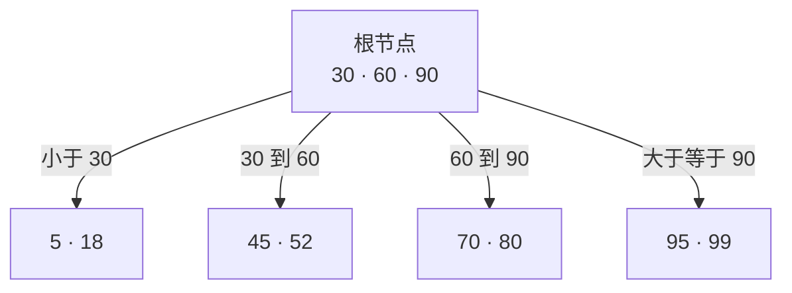
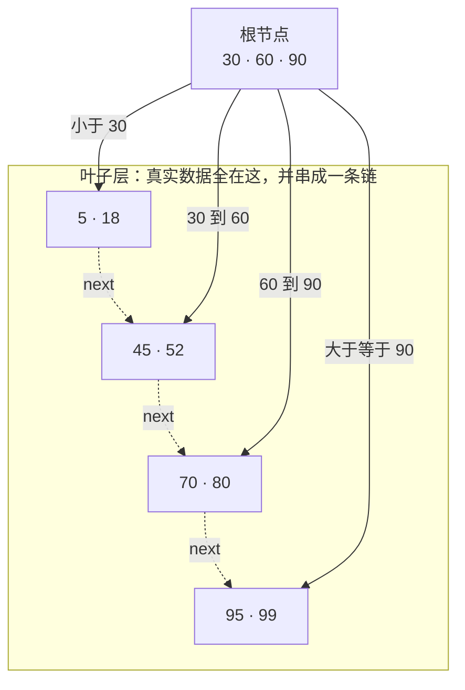

# PG 的 B-tree 与 MySQL 的 B+ 树

> 结论先放这儿：**两者都是平衡多路搜索树，都靠「页 + 有序 + 分裂」把随机 IO 压成对数级，但组织方式完全不同**。InnoDB 是「索引即数据」的索引组织表，PG 是「索引只负责指路」的堆表。面试里能把这一条讲清楚，剩下的细节都是它的推论。

---

## 一、基础结构：B-tree 和 B+ 树差在哪

B-tree 就是「多路版的二叉搜索树」：一个节点存一堆 key，n 个 key 切出 n+1 个区间、配 n+1 个孩子，所有叶子在同一层。**数据可以停在任意一层，内部节点本身就是数据节点。**



查 `52`：根节点里二分，落在 30 和 60 之间，进第二个孩子，在 `45 · 52` 里命中，**两层就结束**，不用下到叶子。

为什么非要「多路」？一个节点就是一页。8KB 的页装几百个 key 就是几百路分叉，三层能覆盖上亿行，查一行最多读 3 页；二叉树同样数据量要 27 层，那就是 27 次随机 IO。**多路不是为了省比较，是为了省磁盘访问。**

---

B+ 树的改动只有一句话：**把数据全赶到叶子，内部节点降级成路牌**（分隔键会在叶子里重复出现一次）。



一个节点只存「页码 + 分隔键」，扇出从几百涨到上千，树更矮；代价是**任何查询都必须走到叶子**，路径固定但多一层。真正换来的是第三点：

**范围扫描变成顺链扫。** 查 45~80：从根定位到 45 所在的叶页，然后顺着叶子链表往后读，读到 80 停 —— 线性、顺序、几乎全是顺序 IO。同样的活 B-tree 得在散落各层的节点间反复跳，每跳一次都可能是随机 IO。数据库里 `BETWEEN`、`>`、`ORDER BY`、`JOIN` 全在吃这条链，所以 B+ 树赢在这里。

一句话收：**B-tree 把数据均匀铺在整棵树上，B+ 树把数据全堆在叶子再串成链；前者为单点查询优化，后者为范围查询优化。**

---

## 二、两种数据库的实际实现

### MySQL InnoDB：严格 B+ 树（聚簇索引即数据）

```
                 [ 根页 16KB：只有 key + 子页号 ]
                    /                    \
          [ 非叶页 ]                      [ 非叶页 ]
           /      \                        /      \
    ┌──────────┐  ┌──────────┐      ┌──────────┐  ┌──────────┐
    │ 叶页     │⇄ │ 叶页     │  ⇄   │ 叶页     │⇄ │ 叶页     │
    │ 整行数据 │  │ 整行数据 │      │ 整行数据 │  │ 整行数据 │
    └──────────┘  └──────────┘      └──────────┘  └──────────┘
        叶子之间：双向链表；页内记录：单向链表 + page directory 稀疏索引
```

- 非叶节点**只存键**，数据全在叶子 → 典型 B+ 树
- 主键索引（聚簇索引）的叶子节点就是**整行数据**，所以「按主键查一次就够」
- 二级索引叶子存 `(索引列…, 主键值)`，要完整行就得拿主键回聚簇索引再走一次（**回表**）
- 建表必须有一个聚簇索引：PK → 第一个 NOT NULL 唯一索引 → 隐式 6 字节 `DB_ROW_ID`

### PostgreSQL：Lehman-Yao 并发 B-tree（不是 B+ 树）

```
        [ meta page ] → [ root 页 8KB ]
              /                  \
      [ 内部页 ]                 [ 内部页 ]
        |     \                   |     \
   ┌────────┐ ┌────────┐     ┌────────┐ ┌────────┐
   │ 内部页 │ │ 叶页   │     │ 叶页   │ │ 叶页   │
   │ key+TID│ │ key+TID│ ... │ key+TID│ │ key+TID│
   └────────┘ └────────┘     └───┬────┘ └───┬────┘
                    prev ←───────┘          └──────→ next
                 每页带 high key：本页所有键都小于它
```

- **内部节点也保存数据指针（TID）**，不强制所有键都下推到叶子 → 结构上是 B-tree 而非 B+
- 每个页都有 **high key**（本页键的上界），配合右兄弟指针实现并发插入时的**单侧分裂**：分裂只影响右邻居，读者不需要停下来
- 页大小 **8KB**，叶页之间 `prev` / `next` 双向链接（PG 10 起才真正支持反向扫描，之前只能回根重扫）
- 索引项里存的是 **TID（ctid = 物理块号 + 块内偏移）**，不是主键

---

## 三、InnoDB 侧要记住的细节

1. **页结构**：数据页默认 16KB，页内记录按主键顺序排成**单向链表**，页头有个 **page directory**（稀疏槽，每 4~8 条记录一个槽），查找时先二分槽、再在组内顺序找。叶子页之间是**双向链表**，所以范围扫描和 `ORDER BY` 可以顺着链走。

2. **分裂行为**：
   - 随机插入：页满后新页，大致对半劈，产生约 50% 的碎片
   - **顺序自增插入**：分裂点靠右端，页面填得更满、树也更紧凑 → 这就是「主键尽量自增、避免 UUID」的真正原因
   - 页利用率低于 **`MERGE_THRESHOLD`（默认 50%）** 时，访问到该页会尝试与邻居合并

3. **分裂会向上传播**：叶子页分裂可能导致父页分裂，一路传到根；根分裂时树高 +1。

4. **联合索引**：叶子存 `(a, b, c, PK)`，按最左前缀有序，所以 `(a,b,c)` 天然支持 `a`、`a,b`、`a,b,c` 前缀 —— 等于顺手建了三个索引，但 `c` 单独用不了。

5. **有隐藏列**：聚簇索引记录里带 `DB_TRX_ID`、`DB_ROLL_PTR`，MVCC 靠 undo log + Read View 判断可见性，**索引项本身不存多个版本**。二级索引没有这两个列，一致性读是拿到 PK 回表时，在聚簇索引上判断可见性。

6. **NULL 值**：InnoDB 索引里存 NULL，`IS NULL` 能走索引。

7. **没有 fillfactor**：InnoDB 不暴露填充因子，页空间管理由内部决定（这点和 PG 差别很大）。

---

## 四、PostgreSQL 侧要记住的细节

1. **Lehman-Yao 的并发模型**：树不整体加锁，插入走「先分裂右邻居、再向下」的**自顶向下（top-down）**路线；读路径只需短暂持有页的共享锁，不会被写阻塞。这是 PG 索引并发能力好的根本原因。

2. **high key 的作用**：每个页保存一个「本页所有键都小于它」的高键，用来判断某页有没有因为并发分裂而「过时」，从而安全地往右走。这是无锁读正确性的关键。

3. **索引项指向 TID**：所以 PG 查询是「索引 → 堆取行」两步，**没有聚簇索引这回事**。`CLUSTER` 只是一次性的物理重排，后续更新照样会把行散开。

4. **MVCC 的代价**：同一个逻辑行的每个版本都占一个索引项，删除／更新（非 HOT）会留下**死索引项**，必须靠 **vacuum** 清理；长期不 vacuum 的表索引会极度膨胀（index bloat）。PG 14 起有 bottom-up index deletion 缓解。

5. **HOT 更新**：如果更新只改非索引列、且新版本能放进同一个页，就不新增索引项，只更新堆内指针链 → **所以 B-tree 的 `fillfactor` 默认 90，留 10% 空间给 HOT**。这就是「更新频繁的表为什么要调低 fillfactor」的答案。

6. **index-only scan 需要 Visibility Map**：索引扫到 TID 后默认要回堆确认可见性，只有当该页在 **VM 中被标记为 all-visible** 时才能纯索引返回。这就是「明明覆盖了索引却还要回表」的原因。

7. **重复值多的时候 PG 更难做**：PG 12 引入 **deduplication**，把同一页内重复键合成 posting list，多个 TID 共用一个键项。但低区分度列（状态、类型）建 B-tree 仍然不划算，应该考虑部分索引、GIN 或 BRIN。

8. **内部节点也存数据**：这是和 B+ 最本质的结构差异 —— 范围扫描不一定非要下到最左叶子，可能中途就命中；也因此 PG 索引不像 B+ 那样对「遍历全部」有强保证。

9. **NULL 的排序**：PG 默认 `NULLS LAST`（NULL 视为大于一切），可显式 `ASC NULLS FIRST`；唯一索引里多个 NULL 是允许的（除非 `NULLS NOT DISTINCT`，PG 15+）。

---

## 五、逐项对比

| 维度 | MySQL InnoDB | PostgreSQL |
|---|---|---|
| 树类型 | 严格 B+ 树 | Lehman-Yao 并发 B-tree（**非** B+） |
| 表的组织 | 索引组织表，数据即主键索引 | 堆表 + 独立索引 |
| 数据放哪 | 只在叶子节点 | 叶子**和**内部节点都能指向元组 |
| 节点大小 | 16 KB | 8 KB |
| 索引项内容 | 叶子 = 整行 / 二级索引 = (列, 主键) | (键, ctid) |
| 主键查询 | 1 次树遍历 | 索引 + 堆，2 次访问 |
| 二级索引回表 | 拿主键再走一次聚簇索引 | 拿 ctid 直接定位堆页 |
| 叶子链表 | 双向 | 双向（PG 10+ 支持反向扫描） |
| 树高 | 页大，同数据量下更矮 | 页小，一般多一级 |
| MVCC 实现 | undo log + 隐藏列，索引项不分版本 | 堆内多版本，索引指向所有版本，靠 vacuum 清 |
| 死索引项 | 无（靠 purge undo） | 有，靠 vacuum，否则膨胀 |
| 顺序插入 | 自增主键友好，页填得满 | 同样走右侧分裂（fastpath） |
| 重复键 | 每条独立存 | PG 12+ 去重压缩为 posting list |
| 页合并／回收 | `MERGE_THRESHOLD` | vacuum + FSM，空页可回收复用 |
| 填充控制 | 无 fillfactor 参数 | `fillfactor` 默认 90 |
| 并发读写 | 页 latch + 记录锁 / next-key lock | 单侧分裂，读不被写阻塞 |
| 覆盖索引 | 支持（`EXPLAIN` 显示 Using index） | 需 all-visible 页才是 Index Only Scan |
| 索引类型多样性 | B+、Hash(AHI)、Fulltext、R-tree | B-tree、Hash、GiST、SP-GiST、GIN、BRIN |

---

## 六、这些差异在实战里的表现

1. **「PG 主键查询比 MySQL 慢一档？」**
   半对。PG 多一次堆访问，但那是按 ctid 直取物理页；InnoDB 少一次访问，但聚簇索引叶子里要搬整行，页密度更低。真正拉开差距的是**列宽**和是否覆盖索引，不是次数本身。

2. **UUID 主键为什么两边都劝退？**
   都是「随机插入 → 页分裂 → 利用率掉到 50% → 索引膨胀 → buffer pool 命中率下降」。解法也一致：用**单调递增**的 ID（雪花、ULID），或者 InnoDB 用自增、PG 用 `GENERATED ALWAYS AS IDENTITY`。

3. **为什么 PG 老提索引膨胀，MySQL 不太提？**
   PG 的索引项指向每个版本元组，删除／更新留下死项，必须 vacuum；InnoDB 的索引项稳定，MVCC 版本在 undo 里，由 purge 线程后台清。**所以 PG 必须盯 `n_dead_tup` 和 autovacuum。**

4. **低区分度列建索引的区别**
   MySQL：每条都进索引，`status` 这种值少的列，索引可能比表还大，优化器干脆不走它。
   PG：PG 12 后有 dedup，体积好一些，但「走索引要扫一堆 TID 再回表」的成本还在 → 两边都更适合**部分索引 / 位图 / BRIN**。

5. **范围扫描和 `ORDER BY`**
   两者都能顺叶子链表走，不用额外排序。区别在方向：MySQL 叶子双向，扫哪边都行；PG 10 之前反向要回根重扫。

6. **面试里怎么答「PG 的索引是什么结构」**
   一句话版：

   > PG 用的不是教科书 B+ 树，是 Lehman-Yao 的高并发 B-tree：内部节点也能带数据指针，靠 high key 和右兄弟指针做单侧分裂，所以读不被写阻塞；页是 8KB，索引项存 ctid 指向堆表，因此没有聚簇索引，主键查询要回堆，MVCC 的死版本还得靠 vacuum 清。

   对比版：

   > MySQL 是索引组织表，B+ 树叶子存整行、非叶只存键、16KB 页，二级索引靠主键回表；PG 是堆表，索引独立、8KB 页，索引项存物理位置。想清楚「数据放不放在索引里」这一条，其他差异都能自己推出来。

---

## 附：速记

- InnoDB：16KB 页 / 严格 B+ / 叶子存整行（聚簇）/ 非叶只存 key / 二级索引存主键 → 回表 / 自增主键省分裂 / 无 fillfactor
- PG：8KB 页 / Lehman-Yao B-tree（非 B+）/ 内部节点也存 TID / high key + 右兄弟指针 → 单侧分裂、读不阻塞 / 索引项存 ctid → 无聚簇、要回堆 / MVCC 死项靠 vacuum / fillfactor 默认 90 保 HOT
- 共同的底层逻辑：**用多路平衡 + 有序页 + 顺序叶子链，把随机 IO 变成几层页查找 + 一次顺序扫描**
- 差异的源头只有一个：**数据是否和索引长在一起**
