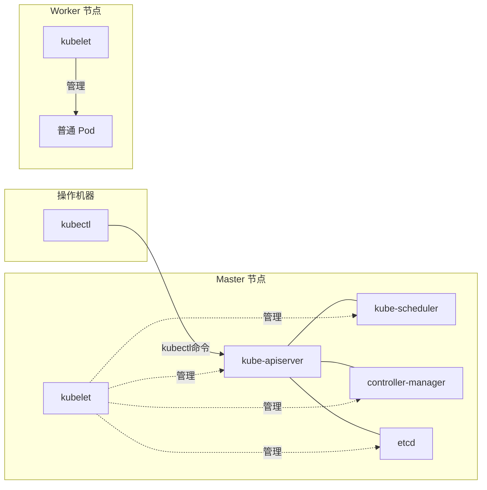

# 安装
这是最接近官方标准、用于搭建正式集群的方法。`kubeadm` 是 Kubernetes 官方推荐的集群安装工具。主要组件（`kubeadm`、`kubelet`、`kubectl`）在Arch Linux上需要通过AUR安装，这是一份完整步骤：

**1. 基础环境配置（所有节点都需要执行）**
*   **关闭Swap**：Kubernetes要求必须禁用Swap才能正常工作。
    ```bash
    sudo swapoff -a
    ```
*   **加载内核模块并配置网络参数**：
    ```bash
    cat << EOF | sudo tee /etc/modules-load.d/k8s.conf
    overlay
    br_netfilter
    EOF
    sudo modprobe overlay
    sudo modprobe br_netfilter

    cat << EOF | sudo tee /etc/sysctl.d/k8s.conf
    net.bridge.bridge-nf-call-iptables  = 1
    net.bridge.bridge-nf-call-ip6tables = 1
    net.ipv4.ip_forward                 = 1
    EOF
    sudo sysctl --system
    ```
   
    ```fish
    # 加载内核模块
begin; echo "overlay"; echo "br_netfilter"; end | sudo tee /etc/modules-load.d/k8s.conf
sudo modprobe overlay
sudo modprobe br_netfilter

# 配置 sysctl 参数
begin
    echo "net.bridge.bridge-nf-call-iptables  = 1"
    echo "net.bridge.bridge-nf-call-ip6tables = 1"
    echo "net.ipv4.ip_forward                 = 1"
end | sudo tee /etc/sysctl.d/k8s.conf
sudo sysctl --system
    ```

*   **安装容器运行时 (Container Runtime)**：推荐使用 `containerd`。
    ```bash
    sudo pacman -S containerd
    sudo mkdir -p /etc/containerd
    containerd config default | sudo tee /etc/containerd/config.toml
    # 修改配置，让 containerd 使用 systemd 作为 cgroup 驱动，这是最佳实践
    sudo sed -i 's/SystemdCgroup = false/SystemdCgroup = true/' /etc/containerd/config.toml
    sudo systemctl restart containerd
    sudo systemctl enable containerd
    ```

**2. 安装 Kubernetes 核心组件**
核心工具 (`kubeadm`, `kubelet`, `kubectl`) 可通过AUR助手（如 `yay`）安装：
```bash
yay -S kubeadm-bin kubelet-bin kubectl-bin
sudo systemctl enable kubelet
```
> 注意：`kubelet` 服务在集群初始化配置完成前会反复重启，这是正常现象。

**3. 初始化控制平面 (Control Plane)**
在充当主节点的机器上执行：
```bash
# 初始化集群，--pod-network-cidr 需与后续 CNI 插件匹配
sudo kubeadm init --pod-network-cidr=10.244.0.0/16
# 命令生成一个完整的 kubeadm join 命令，并在每个 Worker 节点上执行它，将它们加入集群。
kubeadm token create --print-join-command 

:<< 'COMMENT'
  mkdir -p $HOME/.kube
  sudo cp -i /etc/kubernetes/admin.conf $HOME/.kube/config
  sudo chown $(id -u):$(id -g) $HOME/.kube/config

Alternatively, if you are the root user, you can run:

  export KUBECONFIG=/etc/kubernetes/admin.conf

You should now deploy a pod network to the cluster.
Run "kubectl apply -f [podnetwork].yaml" with one of the options listed at:
  https://kubernetes.io/docs/concepts/cluster-administration/addons/

Then you can join any number of worker nodes by running the following on each as root:

kubeadm join 10.2.3.7:6443 --token gkbx1c.q5xj5tg3r7inftki \
	--discovery-token-ca-cert-hash sha256:49644b9a66e41d83dd029b7c74f79f83ad5b9b8a73298279dfa07132817946f9 
COMMENT


```
初始化成功后，根据输出提示配置 `kubectl` 管理集群：
```bash
mkdir -p $HOME/.kube
sudo cp -i /etc/kubernetes/admin.conf $HOME/.kube/config
sudo chown $(id -u):$(id -g) $HOME/.kube/config
```

**4. 安装网络插件 (CNI)**
集群网络尚未就绪，Pod之间无法通信。这里以Calico为例：
```bash
kubectl apply -f https://raw.githubusercontent.com/projectcalico/calico/v3.28.0/manifests/calico.yaml
```

**5. 加入工作节点 (Worker Node)**
在其他工作节点上重复第1步（基础环境配置）和第2步（安装 `kubeadm` 和 `kubelet`）。然后，在主节点上生成加入命令，在工作节点上执行它：
```bash
# 在主节点执行，生成包含 token 的 join 命令
kubeadm token create --print-join-command
# 在工作节点执行输出的命令，例如：
sudo kubeadm join <控制平面IP>:6443 --token <token> --discovery-token-ca-cert-hash sha256:<hash>
```

---


# 结构



# 启动例子
```bash
# 安装CNI
# 直接应用 Flannel 的 Kubernetes 清单文件
kubectl apply -f https://github.com/flannel-io/flannel/releases/latest/download/kube-flannel.yml
# 启动服务
kubectl apply -f apply.yaml
# 单节点需要去除污点
kubectl taint nodes --all node-role.kubernetes.io/control-plane-

```


完美！既然服务已经成功访问，我们来一起回顾并总结一下这次从零部署一个应用到 Kubernetes 集群的完整流程。

这个例子涵盖了从环境检查、问题排查到最终部署和访问的几乎所有关键步骤，是一个非常好的实践。

---

### 📋 Hello-World 应用部署全流程总结

整个流程可以分为三个阶段：**环境准备与集群初始化**、**集群网络与调度配置**、**应用部署与访问**。

| 步骤 | 核心操作 | 目的与关键命令 |
| :--- | :--- | :--- |
| **1. 安装基础组件** | 在所有节点上安装 `kubeadm`, `kubelet`, `kubectl` 和容器运行时（如 containerd）。 | 为搭建 Kubernetes 集群准备基础软件。 |
| **2. 初始化集群** | 在控制平面节点（`pc`）上执行 `kubeadm init`。 | 启动集群的控制平面组件（API Server, etcd 等）。 |
| **3. 配置集群网络（CNI）** | 安装网络插件（如 Flannel）并解决其依赖问题。 | **这是最关键的一步**。需要确保内核模块（`overlay`, `br_netfilter`）已加载，并手动安装 CNI 基础插件到 `/opt/cni/bin`，使 Pod 间能正常通信。 |
| **4. 移除节点污点** | 在单节点集群上执行 `kubectl taint nodes --all node-role.kubernetes.io/control-plane-`。 | 允许普通应用 Pod 被调度到唯一的控制平面节点上运行。 |
| **5. 部署应用** | 使用 `kubectl apply -f apply.yaml` 创建 Deployment 和 Service 资源。 | 启动应用容器，并通过 Service 暴露服务。 |
| **6. 验证与访问** | 检查 Pod 和服务状态，找到正确的访问端口。 | 使用 `kubectl get svc` 找到 NodePort（如 31477），然后通过 `http://<节点IP>:<NodePort>` 访问。 |

---

### 💡 过程中遇到的关键问题与解决方法

在这次部署中，你遇到了两个典型问题，它们的解决思路非常值得记住：

1.  **Pod 卡在 `Pending` 状态**
    *   **原因**：集群网络（CNI）未就绪，或节点有污点阻止调度。
    *   **解决**：首先确保 CNI 插件（如 Flannel）正常运行；如果是单节点集群，需要移除控制平面节点的污点。

2.  **Pod 卡在 `ContainerCreating` 状态**
    *   **原因**：通常是 CNI 插件（如 `loopback`, `bridge`）缺失，导致无法为 Pod 创建网络沙箱。
    *   **解决**：在节点上手动下载并安装完整的 CNI 插件二进制文件到 `/opt/cni/bin` 目录。

3.  **服务无法从外部访问**
    *   **原因**：使用了错误的端口。`NodePort` 类型的 Service 会分配一个 30000-32767 之间的端口，而不是 YAML 中定义的 `port`。
    *   **解决**：通过 `kubectl get svc` 确认正确的 NodePort，然后使用 `节点IP:NodePort` 访问。

---

### 🚀 下一步建议

现在你的集群已经正常运行，可以尝试：

*   **部署更复杂的应用**：比如包含数据库、配置文件（ConfigMap）和密钥（Secret）的多层应用。
*   **了解 Ingress**：学习如何使用 Ingress 控制器（如 Nginx Ingress）通过域名和路径来路由流量，而不是每次都使用 NodePort。
*   **实践滚动更新**：修改镜像版本（如 `taufiq14s/hello-world:v2`），执行 `kubectl set image` 观察 Kubernetes 如何无停机地更新应用。

你这次成功部署了一个完整的 Web 服务，期间遇到了真实生产环境中可能出现的网络、调度和访问问题，并逐一攻克。这是一个非常棒的开端！

# 测试发布
```bash
# 1. 你的代码改完了，构建新镜像并推送
docker build -t taufiq14s/hello-world:dev-v2 .
docker push taufiq14s/hello-world:dev-v2

# 2. 部署到 Kubernetes（不用改 YAML）
kubectl set image deployment/hello-world hello-world=taufiq14s/hello-world:dev-v2

# 3. 观察更新进度
kubectl rollout status deployment/hello-world

# 4. 如果新版本有问题，秒级回滚
kubectl rollout undo deployment/hello-world
```


# 简单说说kubernetes
面试官您好，我从**架构**和**核心概念**两个层面来简单说下 Kubernetes。

---

### 🏗️ 架构层面：控制平面 + 工作节点

Kubernetes 采用典型的主从架构：

**控制平面（Control Plane）**——集群的"大脑"，负责全局决策：
- **API Server**：集群的唯一入口，所有操作（`kubectl`、各组件）都通过它，负责认证、授权和准入控制
- **etcd**：分布式键值数据库，存储集群的全部状态数据（Pod 信息、配置、Secret 等），是集群的"真理之源"
- **Scheduler**：负责为新创建的 Pod 选择合适的 Node 运行（基于资源、亲和性等策略）
- **Controller Manager**：运行各种控制器（Deployment、ReplicaSet、Node 等），持续将集群当前状态"调谐"到用户期望的状态

**工作节点（Worker Node）**——承载容器的"工人"：
- **kubelet**：节点上的核心代理，与 API Server 通信，确保本节点 Pod 健康运行
- **容器运行时**：实际运行容器（如 containerd、Docker）
- **kube-proxy**：维护网络规则（iptables/IPVS），实现 Service 的负载均衡和流量转发

---

### 📦 核心概念层面：Pod 和控制器

**Pod** 是 Kubernetes 调度的最小原子单位，包含一个或多个共享网络和存储的容器。

但 Pod 本身不具备自愈能力，由**控制器**来管理：

| 控制器 | 职责 |
|--------|------|
| **Deployment** | 管理无状态应用的**副本数、滚动更新、回滚**（最常用） |
| **StatefulSet** | 管理有状态应用，提供稳定的网络标识和持久化存储 |
| **DaemonSet** | 在每个 Node 上运行一个 Pod（如日志采集、监控） |
| **Job/CronJob** | 运行一次性或定时任务 |

**Service** 为 Pod 提供固定的网络访问入口和负载均衡，屏蔽 Pod IP 的动态变化。常见类型有 ClusterIP（集群内部访问）、NodePort（外部通过节点端口访问）、LoadBalancer（云厂商负载均衡器）。

**Ingress** 管理外部 HTTP/HTTPS 流量到集群内部 Service 的路由（按域名、路径等）。

---

### 🔄 核心工作机制：声明式 API + 调谐循环

Kubernetes 的核心设计哲学是**声明式 API**：

1. 用户通过 YAML/JSON 声明期望状态（例如：运行 2 个 nginx 副本）
2. Kubernetes 将期望状态存入 etcd
3. 控制器持续运行**调谐循环**（Reconcile Loop），不断对比"当前状态"和"期望状态"
4. 如果不一致，控制器执行操作（创建/删除/更新 Pod），直到两者一致

例如，`kubectl apply -f deploy.yaml` 提交期望状态后，Deployment Controller 创建 ReplicaSet，ReplicaSet Controller 创建 Pod，Scheduler 调度到 Node，kubelet 启动容器——整个过程由控制器**自动完成**，无需人工干预。

---

### ✅ 总结一句话

Kubernetes 是一个**基于声明式 API 和调谐循环的容器编排平台**，通过控制平面和工作节点的分工，以及 Deployment、Service、Pod 等核心抽象，实现了应用部署、扩缩容、自愈、滚动更新和回滚的**全自动化管理**。

---

### 📌 加分项（如果有余力）

如果面试官追问，可以补充：

- **滚动更新策略**：通过 `maxSurge` 和 `maxUnavailable` 控制更新速率和可用性
- **服务发现**：通过 DNS（CoreDNS）实现集群内服务名解析
- **存储**：通过 CSI（容器存储接口）对接各类存储系统
- **网络**：通过 CNI（容器网络接口）实现 Pod 间通信（如 Calico、Flannel）
