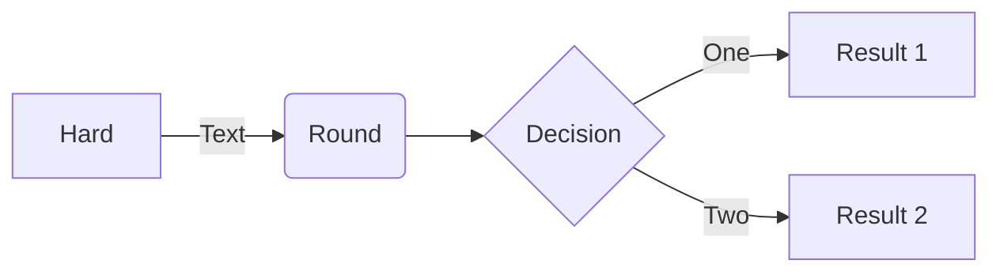
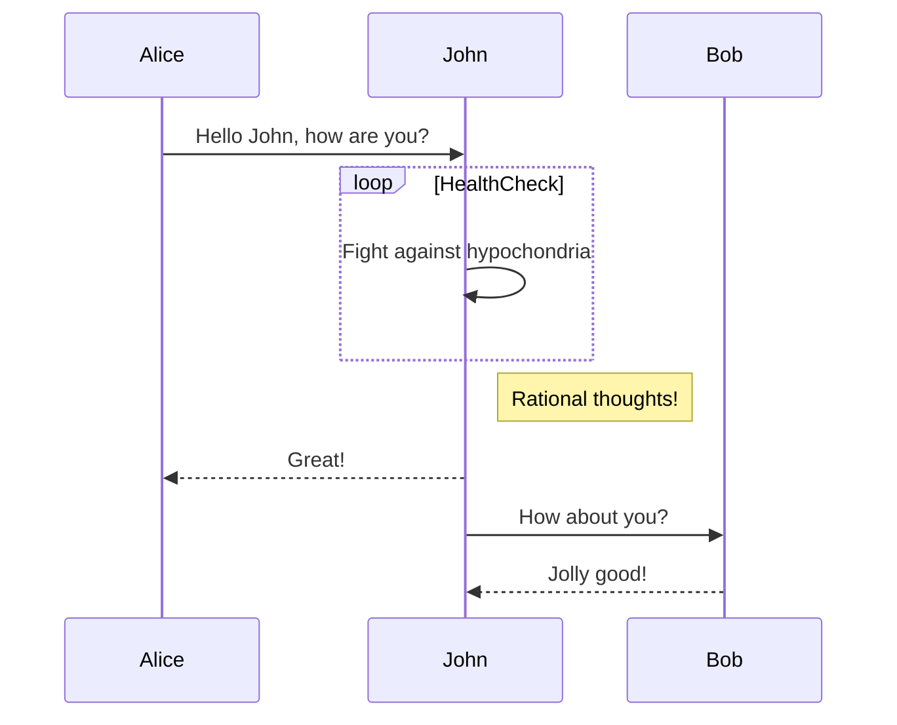
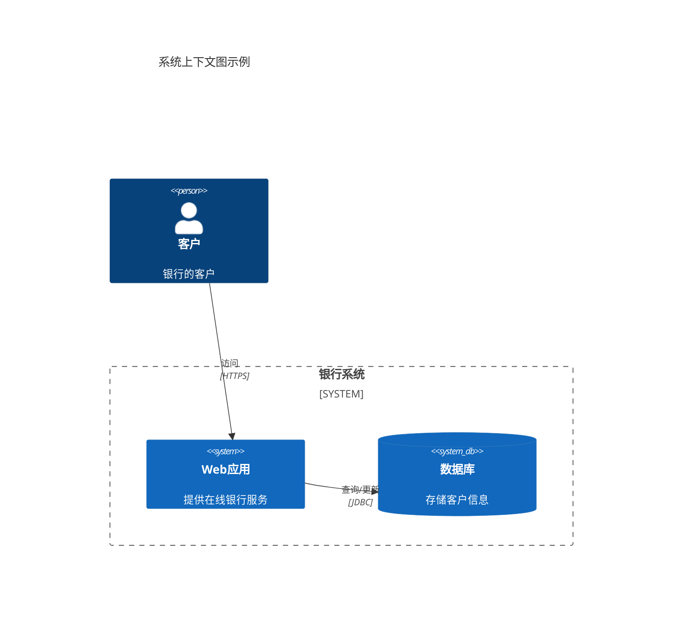

### 流程图



- 反向

  ```bash
  
  ```
  
- 箭线

  ```bash
  标准连线：-->，用于表示一个普通的方向连接。
  
  带标签的连线：-- 文本 --> 或 -["文本"]->，可以在连接线上添加描述性文字。
  
  虚线连线：-.->，用于表示一种不同类型的关联或弱关系。
  
  点线连线：-..->，也是用来表示一种特殊的关系类型。
  
  加粗连线：==>，用于强调重要的步骤或关键路径。
  
  加粗带标签的连线：==|text|>，加粗线条加上标签以示重要性和说明。
  
  自定义线条样式：通过使用 style 关键字可以为节点或者边自定义样式，比如颜色、粗细等。
  ```

  

### 时序图




Mermaid的`sequenceDiagram`支持多种关键字来帮助你创建详细的序列图。以下是一些主要的关键字和它们的功能：

1. **participant**：定义序列图中的参与者（可以是用户、系统或组件等）。你可以使用简短的名字或者通过`as`关键字指定一个较长的描述性名称。
    ```mermaid
    sequenceDiagram
        participant A as Alice
        participant B as Bob
    ```

2. **->> 和 ->**：表示从一个参与者到另一个参与者的同步消息传递。`->>`通常用来表示普通的消息传递，而`->`也可以用于相同的目的，但有时被用来强调更轻量级或非阻塞的调用。
    ```mermaid
    A->>B: 发送消息
    ```

3. **-->> 和 -->**：类似于`->>`和`->`，但是这些箭头通常用于表示异步消息传递。
    ```mermaid
    A-->>B: 异步发送消息
    ```

4. **activate 和 deactivate**：用于表示某个参与者开始处理任务和结束处理任务的状态变化。这有助于在图表中可视化哪些参与者当前正在执行操作。
    ```mermaid
    A->>B: 请求服务
    activate B
    B->>A: 响应结果
    deactivate B
    ```

5. **opt**：用于标记可选的操作块，仅当特定条件为真时才会发生。
    ```mermaid
    opt 可选操作
        A->>B: 条件满足时的操作
    end
    ```

6. **alt 和 else**：用于定义多个互斥的选择分支，类似于编程语言中的if-else语句。
    ```mermaid
    alt 条件1
        A->>B: 条件1满足时的行为
    else 条件2
        A->>B: 条件2满足时的行为
    end
    ```

7. **loop**：用于表示循环操作。
    ```mermaid
    loop 每日重复
        A->>B: 循环内的操作
    end
    ```

8. **Note**：用于添加注释说明给定的步骤或参与者。可以使用`note left of`, `note right of`, `note over`等指令将注释放置在适当的位置。
    ```mermaid
    note left of A: 这是一个关于A的注释
    note over A,B: A与B之间的交互说明
    ```

9. **autonumber**：自动为每条消息编号，方便追踪顺序。
    ```mermaid
    sequenceDiagram
        autonumber
        A->>B: 第一条消息
    ```

这些关键字让你能够清晰地表达系统间复杂的交互过程，并且可以根据需要对流程进行详细描述。通过组合使用这些关键字，可以创建出既美观又信息丰富的序列图。

### sequenceDiagram

| 符号          | 说明             |
| ------------- | ---------------- |
| `participant` | 参与者（模块）   |
| `actor`       | 参与者（用户）   |
| `alt`         | 多条件分支       |
| `par`         | 可选分支         |
| `->>`         | 实线箭头（同步） |
| `-->>`        | 虚线箭头（同步） |
| `->`          | 实线             |
| `-->`         | 虚线             |


### C4Context

- 关键字

  | 元素 | 作用 |
  | ---- | ---- |
  |      |      |
  |      |      |
  |      |      |

  

C4模型是一种用于描述软件架构的方法，它通过四个不同的抽象层次帮助团队更好地理解和沟通软件架构。Mermaid 是一种允许用户使用文本描述来创建图表的工具，它支持C4模型图的绘制。在Mermaid中绘制C4图时，会使用特定的关键字和语法来定义系统、容器、组件以及它们之间的关系。以下是一些关键元素和关键字：

### 关键元素

1. **系统上下文（Context）**：展示整个系统的高层次视图，包括外部人员和系统。
2. **容器（Container）**：更详细的视图，展示了系统内部的主要容器（例如应用程序、数据库等）及其交互。
3. **组件（Component）**：进一步细化每个容器，展示其内部的组件及它们之间的交互。
4. **代码（Code）**：最详细的视图，通常不直接在C4图中表示，而是通过UML类图等形式展现。

### Mermaid C4图关键字

- `C4Context`：开始一个系统上下文图。
- `Person`：定义一个外部人员或角色。
- `System`：定义一个系统。
- `System_Boundary`：定义一个系统边界。
- `Rel`：定义两个元素之间的关系。
- `BiRel` 是 Mermaid 中用于表示两个元素之间双向关系的关键字
- `Enterprise_Boundary`：定义企业的边界。
- `Container`：定义一个容器。
- `ContainerDb`：定义一个数据库容器。
- `ContainerQueue`：定义一个队列容器。
- `Container_Ext`：定义一个已存在的容器。
- `Component`：定义一个组件。
- `ComponentDb`：定义一个数据库组件。
- `ComponentQueue`：定义一个队列组件。
- `Boundary`：定义一个边界或区域。
- `UpdateElementStyle` 和 `UpdateRelStyle`：更新元素或关系的样式。
- `UpdateLayoutConfig`：更新布局配置。

### 示例代码片段



这个示例定义了一个简单的系统上下文图，其中包含一个客户、一个Web应用和一个数据库，并且定义了它们之间的关系。

在使用Mermaid绘制C4图时，确保遵循C4模型的层级结构，从高层次到底层逐步细化你的架构视图，这样可以帮助团队成员和其他利益相关者更好地理解系统的架构。

### 导出

```bash
# mmdc --> Mermaid Command Line Interface

# 全局安装Mermaid的命令行工具
npm install -g @mermaid-js/mermaid-cli
# 输出一张图片
mmdc -i diagram.mermaid -o diagram.png
```

### flowchart

| 保留字 | 含义             |
| ------ | ---------------- |
| TB     | 从上到下（默认） |
| BT     | 从下到上         |
| RL     | 从右到左         |
| LR     | 从左到右         |
| `---`  | 无箭头连接线     |
| ()     | 圆角方框         |
|        |                  |


