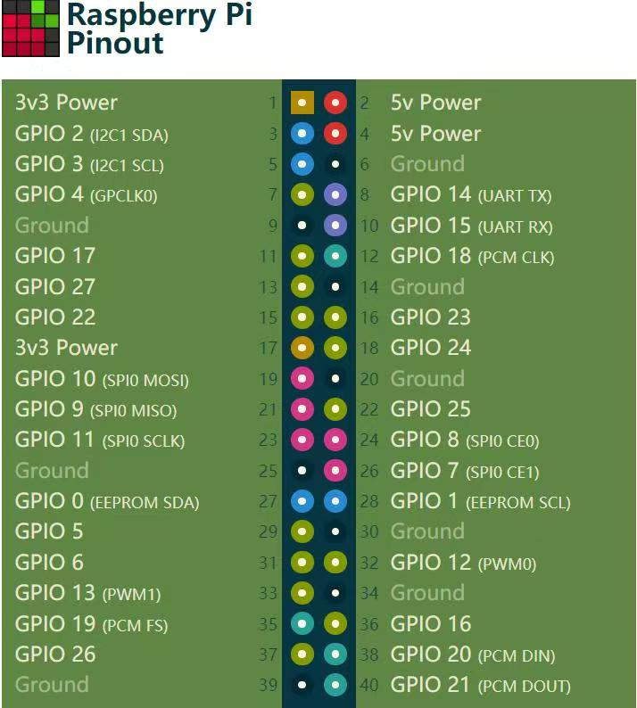

# GPIO


# 安装
```fish
xhost +si:localuser:root && sudo --preserve-env=DISPLAY,XAUTHORITY -E rpi-imager && xhost -si:localuser:root


# 备份系统+usb启动
```
```bash
# 备份为image
sudo dd if=/dev/sda of=./archlinuxarm.img bs=4M status=progress
# 设置usb启动
sudo echo "program_usb_boot_mode=1" | sudo tee -a /boot/config.txt
reboot
vcgencmd otp_dump | grep 17:

pigz -c archlinuxarm.img > archlinuxarm.img.gz
pigz -dc archlinuxarm.img.gz | sudo dd of=/dev/sdb bs=4M status=progress

# 修改 /boot/cmdline.txt
root=PARTUUID=29267926-02 rw rootwait console=serial0,115200 console=tty1 fsck.repair=yes


```
```
```
```

```
